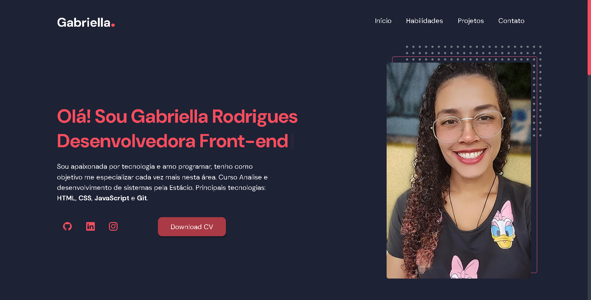

<h1 align="center"> Meu Portfólio </h1>

  <a href="#-tecnologias">Tecnologias</a>&nbsp;&nbsp;&nbsp;|&nbsp;&nbsp;&nbsp;
  <a href="#-projeto">Projeto</a>&nbsp;&nbsp;&nbsp;|&nbsp;&nbsp;&nbsp;
  <a href="#-funcionalidades">Funcionalidades</a>&nbsp;&nbsp;&nbsp;&nbsp;&nbsp;&nbsp;

 

  

  
  

## 🚀 Tecnologias

Esse projeto foi desenvolvido com as seguintes tecnologias:

- HTML e CSS
- JavaScript
- Git e Github

### 💻 Projeto.

- [Acesse o projeto finalizado, online](https://gabyzinha72.github.io/meu-portifolio/)

### ⚙ Funcionalidades

- Projeto responsivo
- Menu de navegação hamburguer
- Scrollbar personalisado

---
